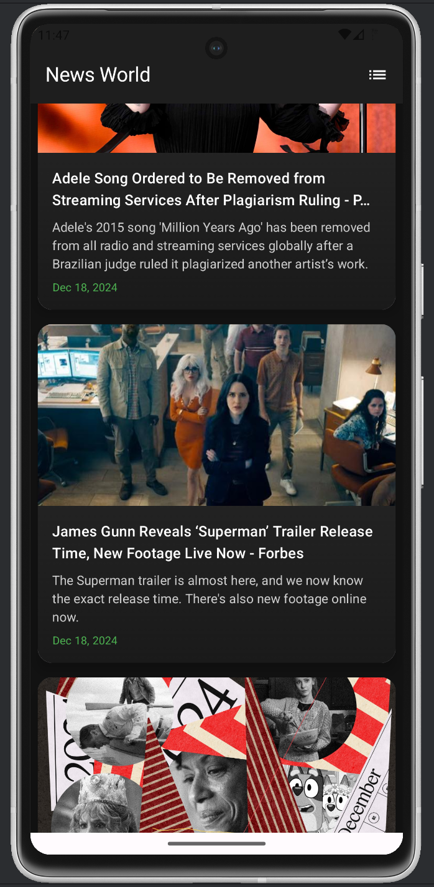

# NewsWorld  

NewsWorld is a feature-rich news application that fetches and displays the latest news from around the globe. Powered by [NewsAPI.org](https://newsapi.org), the app provides categorized news updates, ensuring you stay informed about topics of your interest.  

## Features  

- **Categorized News:** Filter news by categories: Entertainment, Science, Sports, Technology, Health, and Business.  
- **Dynamic Content:** Fetches real-time news from [NewsAPI.org](https://newsapi.org).  
- **User-Friendly Interface:** Simple and intuitive UI for a seamless browsing experience.  
- **Detailed News View:** Read full news articles with images, headlines, and descriptions.  
- **Responsive Design:** Optimized for various screen sizes, ensuring compatibility across Android devices.  

## Screenshots  

### Home Screen  
  

### Category Filter  
  

### News Details  
  

## Technologies Used  

### Frontend  

- **Language:** Kotlin(JetpackCompose)  
- **Framework:** Android SDK  
- **UI Components:**  
  - RecyclerView for displaying news lists.  
  - CardView for individual news items.  
  - Navigation Components for seamless navigation between screens.  
- **Material Design:** Adhering to Google’s Material Design guidelines for a polished look.  

### Backend  

- **API Integration:**  
  - NewsAPI.org for fetching real-time news data.  
  - Retrofit for making network calls.  
  - Gson for parsing JSON responses.  

### Architecture  

- **MVVM (Model-View-ViewModel):**  
  - Separation of concerns for better maintainability.  
  - ViewModel for managing UI-related data.  
  - LiveData for observing data changes.  

### Other Libraries  

- **Coil:** For loading and caching images efficiently.  
- **OkHttp:** For handling HTTP requests.  
- **AndroidX:** For backward compatibility and modern features.  

## Getting Started  

### Prerequisites  

1. Obtain an API key from [NewsAPI.org](https://newsapi.org).  
2. Ensure you have Android Studio installed on your system.  

### Installation  

1. Clone the repository:  
   ```bash  
   git clone https://github.com/DebugWithAryan/NewsWorld.git
   cd NewsWorld  
